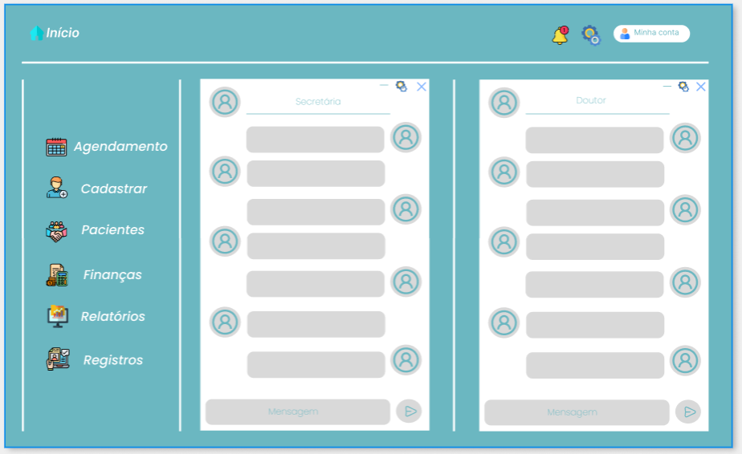

<h1 align='center'>Site Odontológico</h1>

Um projeto de faculdade que envolve a criação de um site relacinado a dentistas que pretende focar na construção de uma plataforma moderna e funcional que atenda às necessidades
de seus pacientes e secretárias. O site incluiria informações sobre os serviços oferecidos, como limpeza,
restaurações, clareamento e outros tratamentos dentários. A interface seria projetada para ser
intuitiva e acessível, garantindo uma navegação fácil, com um design que reflete a confiança e a qualidade dos serviços odontológicos oferecidos.

<h1>Projeto Figma</h1>
<h2>Tela de Login</h2>

   
<h2>Página Principal</h2>

 
